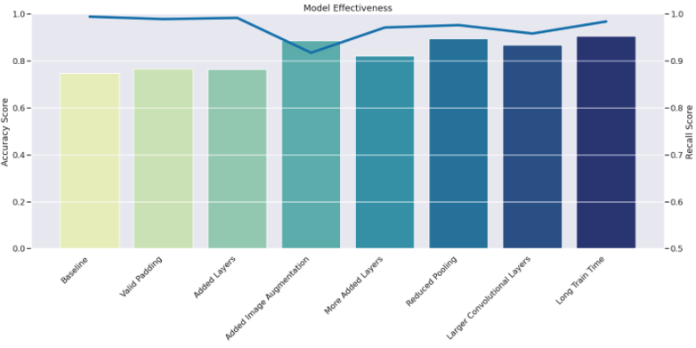
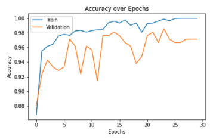
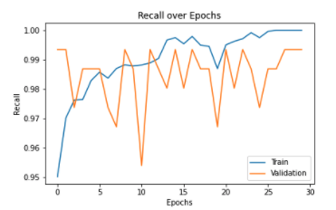
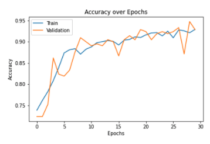
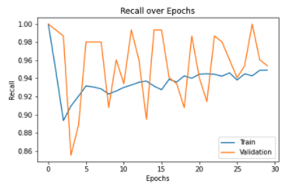
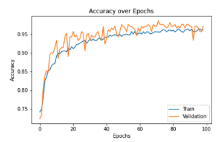
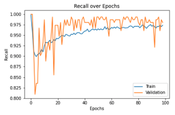
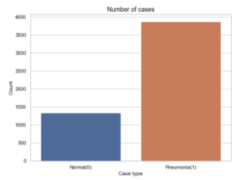

# Diagnosing-Pneumonia_CNN
##### Github Repository: Click [here](https://github.com/grace-arina/Diagnosing-Pneumonia_CNN)
##### Presentation: Click [here](https://www.canva.com/design/DAE4b_Ol82I/VAxNFiW6s3_nfSV5Ehjdyg/edit)
##### Authors: Grace Wambui Arina, Nathaniel Martin, Olgert Hasko, Justin Sohn


## Overview
It was recently found that most of the children hospitalized are having pneumonia in the period from January 2013 to June 2019 that pushed the government in China to perform a chest x-ray for all hospitalized children to check whether they are normal or have pneumonia. It was recommended to build a neural network model which helps to decide whether the child has pneumonia or not from the chest x-rays in a quick way that helps the physicians.

## Stakeholder
As a leading health care agency in Guangzhou, China, the Health Department in China continues to play a critical role by checking chest x-ray for children hospitalized. Our project, presentation, and machine learning model were created for use by the Health Department in China’s government.

## The Business Problem 
The goal is to build a model with high accuracy that classifies any Chest X-ray whether it is NORMAL or PNEUMONIA to help the physician to get the correct diagnosis in no time.

Chest X-ray images (anterior-posterior) of the dataset were selected from retrospective cohorts of pediatric patients of one to five years old from Women and Children’s Medical Center in Guangzhou. All chest X-ray imaging was performed as part of patients’ routine clinical care.

The effectiveness of this classification model will be measured by how well it predicts the PNEUMONIA case and the Normal case.

## Analysis Questions 
- Are the images for the chest X-rays clear enough to build a model?
- Are the two classes (Normal & Pneumonia) imbalanced or balanced?

## Data & Methods
The dataset is divided into three folders: train, test, and val, with subfolders for each picture category (Pneumonia/Normal). There are 5,863 JPEG X-Ray pictures and two categories (Pneumonia/Normal).

These chest X-ray pictures (anterior-posterior) were chosen from retrospective cohorts of children patients aged one to five years at Women and Children's Medical Center in Guangzhou. All chest X-ray imaging was done as part of the patients' regular clinical treatment.

Before the analysis of chest x-ray pictures, all chest radiographs were first screened for quality control by deleting any scans that were of poor quality or were illegible. The picture diagnosis were then assessed by two professional physicians before being authorized for training the AI system. The assessment set was further reviewed by a third expert to account for any grading issues.

## Analysis Graphs

### Model Effectiveness
-  Recall since false negative is bad
-  Recall is unreasonably high for the first few models
-  Big accuracy gains are achieved with image augmentation



### Baseline
- A basic convolutional network and trains on the normal images
- Run for 30 epochs
- Overfits very quickly





### Image Augmentation
- It is an extra convolutional layer
- Image augmentation with rotation, zoom, and stretching
- Run for 30 epochs





### More Epochs and Convolutional Layers
- Even more convolutional layers
- Trains on augmented data
- Run for 30 epochs





### Best Model
- Uses Image Augmentation
- Ran for 100 epochs
- Test Accuracy of ~90%
- Test Recall of ~98%

You can scan this to check our best model in detail on TensorBoard or Click [here](https://tensorboard.dev/experiment/0K1t8rFYTWG06klkGIkjWQ/#scalars)


## Results & Evaluation
- Improved ability to predict high accuracy to classify any Chest X-ray whether it is NORMAL or PNEUMONIA
- Accuracy increased from 74% -> 90%

## Limitations 
- Gather more X-Ray Scans to balance our data
- Medical history to incorporate into our machine learning model for our predictions



## Recommendations 
- Increase awareness regarding the risk of Pneumonia 
- Implement our model to assist hospitals with Pneumonia detection for initial scans
- Have a doctor review scans with 80% or lower prediction

---

#### For more information
Please contact the contributors to this analysis: 
[Grace Wambui Arina](https://www.linkedin.com/in/grace-arina/) |
[Nathaniel Martin](https://www.linkedin.com/in/nathaniel-martin-73b037227/) |
[Olgert Hasko](https://www.linkedin.com/in/olgert-hasko-47519097/) |
[Justin Sohn](https://www.linkedin.com/in/justin-sohn-689901193/) 

**Repository Structure:**
```
├── chest_xray                             <- Data sourced externally and generated from code 
├── images                                 <- Images sourced externally and generated from code 
├── modeling-notebooks                     <- Notebooks on modeling 
├── .gitignore                             <- gitignore 
├── Final_Notebook.ipynb                   <- Narrative documentation of analysis in Jupyter notebook
├── README.md                              <- The top-level README for reviewers of this project
├── modelplotting.py                       <- 
└── tf_board_plotting.ipynb                <- Train-Validation plots for the presentation
